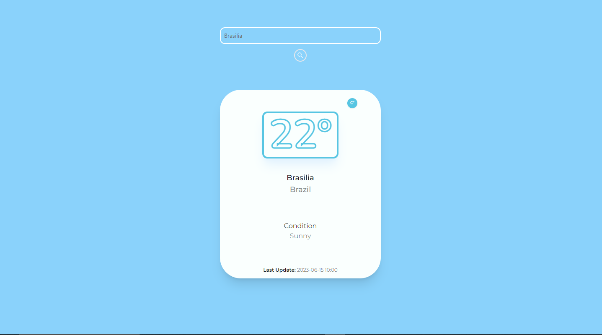

<a name="readme-top"></a>

<!-- PROJECT LOGO -->
<br />
<div align="center">
  <a href="https://weather-app-joaogsp.vercel.app/">
    
  </a>

<h3 align="center">Personal Forecast App</h3>

  <p align="center">
    <span>🚀 Deployed 🚀</span>
    <br />
  </p>
</div>

<!-- ABOUT THE PROJECT -->
## About The Project

<p>A simple weather forecast webapp. Made with cutting-edge technology for my personal growth practice. Simple frontend skills and the ability to consume APIs are applied in this project.</p>



<p align="right"><a href="#readme-top">Go back to top ⬆️</a></p>

### Built With

 ![NodeJS.io] ![Next.js] ![react.js] ![TailwindCSS] ![TypeScript]

<p align="right"><a href="#readme-top">Go back to top ⬆️</a></p>

<!-- GETTING STARTED -->

## Getting Started

This is what you need, if you want, to contribute with this project 😁...

### Prerequisites

Technologies required.

- Node 18.\* minimum<br>
<https://nodejs.org/en/download>

- npm latest

  ```sh
  npm install npm@latest -g
  ```

### Configuration and usage

1. Clone the repo

   ```sh
   git clone git@github.com:JoaoGSP/weather-app.git
   ```

2. Install the packages

   ```sh
   npm install
   # or
   yarn
   ```

3. Run the development server

   ```sh
   npm run dev
   # or
   yarn dev
   # or
   pnpm dev
   ```

<p align="right"><a href="#readme-top">Go back to top⬆️</a></p>

<!-- MARKDOWN LINKS & IMAGES -->
<!-- https://www.markdownguide.org/basic-syntax/#reference-style-links -->

[next.js]: https://img.shields.io/badge/next.js-000000?style=for-the-badge&logo=nextdotjs&logoColor=white
[react.js]: https://img.shields.io/badge/React-20232A?style=for-the-badge&logo=react&logoColor=61DAFB
[nodejs.io]: https://img.shields.io/badge/node.js-6DA55F?style=for-the-badge&logo=node.js&logoColor=white&
[tailwindcss]: https://img.shields.io/badge/tailwindcss-%2338B2AC.svg?style=for-the-badge&logo=tailwind-css&logoColor=white&
[typescript]: https://img.shields.io/badge/typescript-%23007ACC.svg?style=for-the-badge&logo=typescript&logoColor=white&
